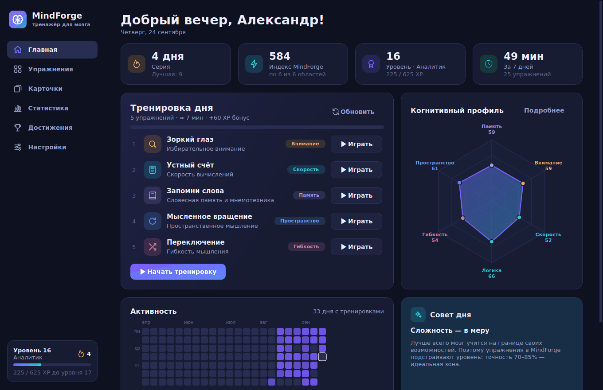
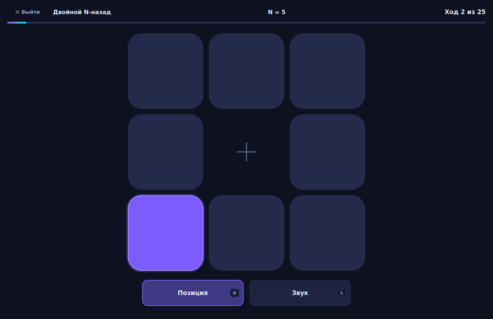
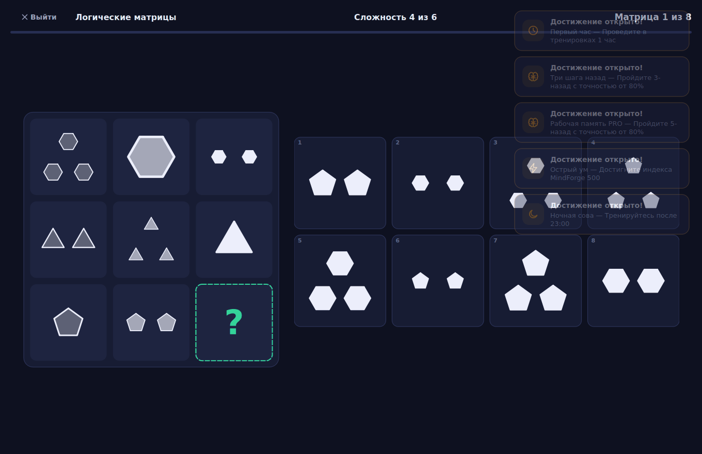
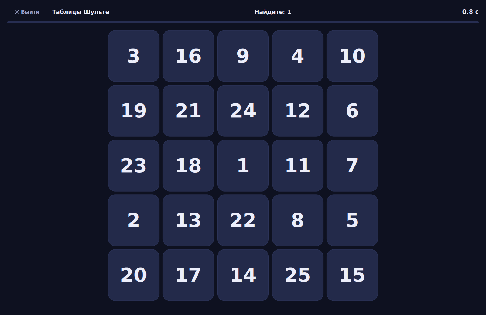
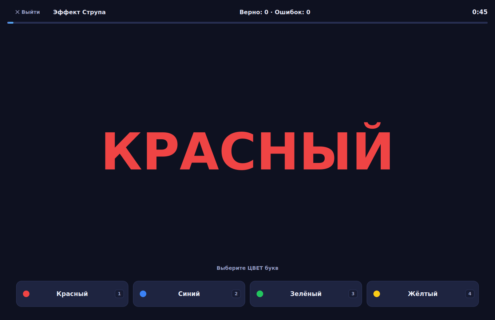
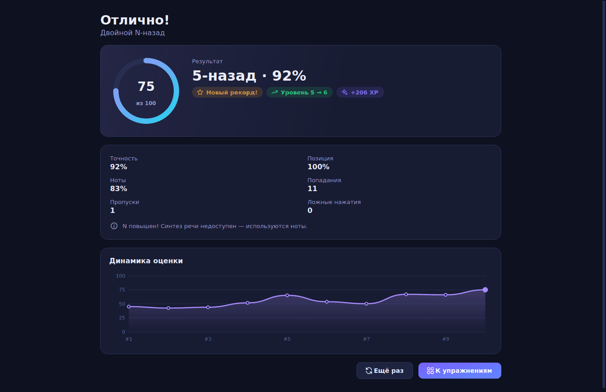
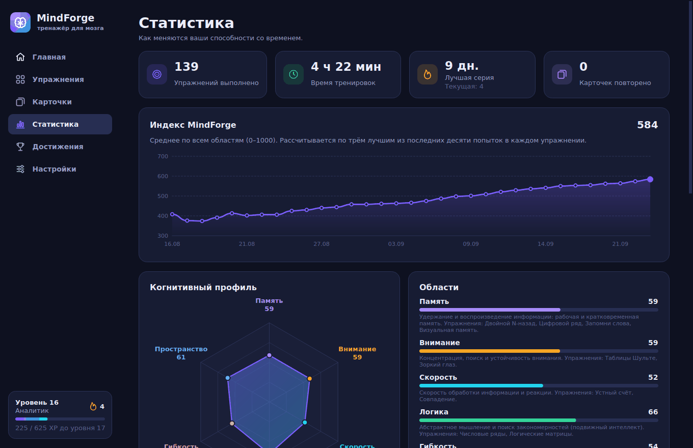
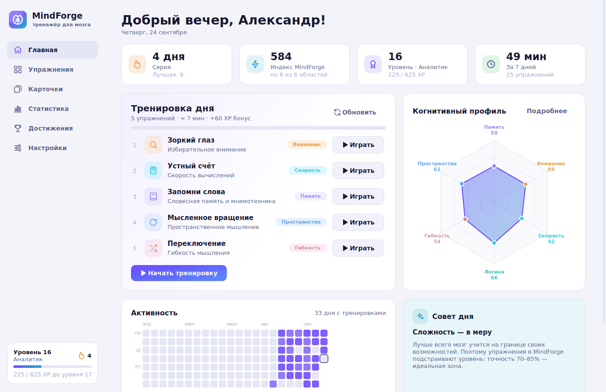

<p align="center">
  
</p>

<h1 align="center">MindForge</h1>
<p align="center"><b>Тренажёр памяти, внимания и интеллекта для Windows</b><br>
14 научных упражнений · адаптивная сложность · план на каждый день · когнитивный профиль · интервальные карточки</p>



## Возможности

- **14 упражнений** на основе методик когнитивной психологии — от «Двойного N-назад» до матриц Равена.
- **Адаптивная сложность.** Каждое упражнение помнит ваш уровень и подстраивает его так, чтобы вы тренировались на границе возможностей (точность 70–85% — оптимальная зона для роста).
- **Тренировка дня.** Сбалансированный план из 3–6 упражнений с упором на ваши самые слабые области; бонус за выполнение.
- **Когнитивный профиль и индекс MindForge (0–1000)** по шести областям: память, внимание, скорость, логика, гибкость мышления, пространственное мышление.
- **Статистика:** график индекса, динамика по каждому упражнению, история, календарь активности.
- **Мотивация:** опыт и уровни со званиями, серия дней подряд, 29 достижений (включая секретные).
- **Карточки с интервальными повторениями** (алгоритм SM-2): свои колоды, импорт из текста и 4 готовые колоды — столицы мира, английские слова, химические элементы, система «цифра-образ».
- Тёмная и светлая темы, синтезированные звуки, озвучивание букв голосом Windows, горячие клавиши.
- Все данные хранятся локально (`%APPDATA%\MindForge`), без интернета и регистрации.

## Упражнения

| Область | Упражнение | Что тренирует |
|---|---|---|
| Память | **Двойной N-назад** | Рабочую память: одновременно следите за позицией и звуком (Jaeggi, 2008) |
| Память | **Цифровой ряд** | Объём кратковременной памяти, прямой и обратный порядок (шкалы Векслера) |
| Память | **Запомни слова** | Словесную память: свободное воспроизведение или узнавание, 370 слов |
| Память | **Визуальная память** | Запоминание узоров на растущей сетке |
| Пространство | **Блоки Корси** | Зрительно-пространственную последовательность |
| Пространство | **Мысленное вращение** | Сравнение повёрнутых и зеркальных фигур (Шепард–Метцлер) |
| Внимание | **Таблицы Шульте** | Скорость и объём внимания; режимы «Классика», «Без подсказок», «Хаос» |
| Внимание | **Зоркий глаз** | Избирательное внимание: найти единственный отличающийся символ |
| Гибкость | **Эффект Струпа** | Тормозный контроль; на высоких уровнях — смена правила |
| Гибкость | **Переключение** | Переключение между задачами «чётное?» / «гласная?» |
| Скорость | **Устный счёт** | Скорость вычислений, 12 уровней сложности |
| Скорость | **Совпадение** | Скорость принятия решений «то же / другое» |
| Логика | **Числовые ряды** | Индуктивное мышление; после ответа показывается правило |
| Логика | **Логические матрицы** | Подвижный интеллект: процедурно генерируемые матрицы в стиле Равена |

<table>
<tr>
<td></td>
<td></td>
</tr>
<tr>
<td></td>
<td></td>
</tr>
<tr>
<td></td>
<td></td>
</tr>
<tr>
<td></td>
<td></td>
</tr>
</table>

## Установка

### Готовая программа (рекомендуется)

Сборка выполняется автоматически в GitHub Actions при каждом изменении кода:

1. Откройте вкладку **Actions** репозитория → последний успешный запуск **Build**.
2. В разделе **Artifacts** скачайте `MindForge-<версия>-windows`.
3. Внутри два варианта:
   - `MindForge-Setup-<версия>.exe` — установщик (ярлыки в меню «Пуск» и на рабочем столе, прав администратора не требует);
   - `MindForge.exe` — переносимая версия, работает без установки.

Чтобы опубликовать релиз со ссылками для скачивания, создайте тег вида `v1.0.0` — workflow сам прикрепит файлы к релизу.

> Windows SmartScreen может предупредить о неподписанной программе: нажмите «Подробнее» → «Выполнить в любом случае».

### Запуск из исходников

Нужен [Python 3.10+](https://www.python.org/downloads/) (при установке отметьте «Add python.exe to PATH»).

```bat
run.bat
```

или вручную:

```bash
pip install -r requirements.txt
python main.py
```

### Сборка .exe своими руками

```bat
build.bat
```

Результат: `dist\MindForge.exe` (один файл) и `dist\MindForge\` (папка для установщика). Установщик собирается [Inno Setup 6](https://jrsoftware.org/isinfo.php): `ISCC installer\MindForge.iss`.

## Как пользоваться

1. Каждый день запускайте **Тренировку дня** на главном экране — 5 упражнений, около 10 минут.
2. Перед каждым упражнением показываются правила, клавиши и научное обоснование; <kbd>Enter</kbd> — начать.
3. После упражнения — оценка 0–100, рекорды, изменение уровня и график прогресса.
4. Для запоминания конкретных знаний используйте раздел **Карточки** — повторяйте то, что предлагает алгоритм.

**Горячие клавиши:** <kbd>Ctrl</kbd>+<kbd>1…6</kbd> — разделы, <kbd>Esc</kbd> — выйти из упражнения, <kbd>Enter</kbd> — начать / далее. Клавиши ответов указаны на кнопках (например, <kbd>A</kbd>/<kbd>L</kbd> в N-назад, <kbd>1</kbd>–<kbd>4</kbd> в Струпе, <kbd>←</kbd>/<kbd>→</kbd> в заданиях «да/нет»).

## Как считаются показатели

- **Оценка упражнения (0–100)** нормирует главный результат к популяционным ориентирам: например, 7 цифр в прямом порядке ≈ 50, таблица Шульте 5×5 за 25 с ≈ 85.
- **Оценка по упражнению** — среднее трёх лучших из последних десяти попыток (устойчиво к случайным неудачам).
- **Область** — среднее по её упражнениям, **индекс MindForge** — среднее по областям × 10.
- **Опыт:** 15 + до 35 XP за упражнение, бонусы за рекорд, повышение уровня, тренировку дня (+60) и достижения (+30).

## Для разработчиков

```
mindforge/
  app.py            главное окно, навигация, запуск
  catalog.py        описания упражнений и их настроек
  progress.py       опыт, серии, профиль, план дня, достижения
  storage.py        SQLite: результаты, настройки, карточки
  srs.py            алгоритм интервальных повторений
  sound.py          синтез звуков (winsound в Windows)
  speech.py         озвучивание букв через QtTextToSpeech
  games/            14 упражнений (логика + отрисовка)
  screens/          главная, библиотека, статистика, достижения, карточки, настройки
  widgets/          карточки, графики, иконки, логотип
  selftest.py       самопроверка собранного .exe (--selftest=report.json)
tests/              89 автотестов: генераторы задач, прогресс, SRS, прохождение каждого упражнения ботом
tools/              генерация иконки и скриншотов
```

```bash
pip install -r requirements-dev.txt
QT_QPA_PLATFORM=offscreen python -m pytest -q
```

CI (`.github/workflows/build.yml`) прогоняет тесты на Linux и Windows, собирает `MindForge.exe` и установщик, а затем запускает самопроверку готового `.exe`: создаются все экраны и проходится каждое упражнение.

## Научная основа

Упражнения построены на классических парадигмах: N-назад (Kirchner, 1958; Jaeggi et al., 2008), тест Струпа (1935), блоки Корси (1972), таблицы Шульте, мысленное вращение (Shepard & Metzler, 1971), переключение задач (Rogers & Monsell, 1995), прогрессивные матрицы Равена. Матрицы генерируются с правилами «постоянство / прогрессия / распределение / арифметика» и сбалансированными вариантами ответа по схеме I-RAVEN, поэтому ответ нельзя угадать по частоте признаков.

Важно: исследования показывают, что тренировка лучше всего улучшает сами тренируемые навыки, а перенос на «общий интеллект» умеренный. Максимальный эффект дают регулярность, сон, физическая активность и изучение нового — об этом напоминают советы дня в приложении.
