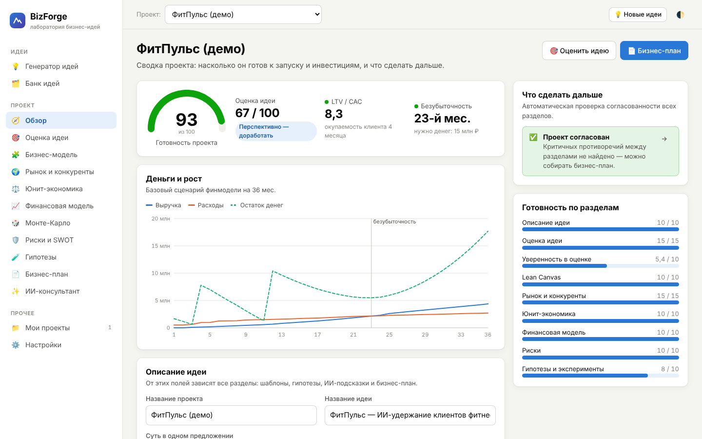
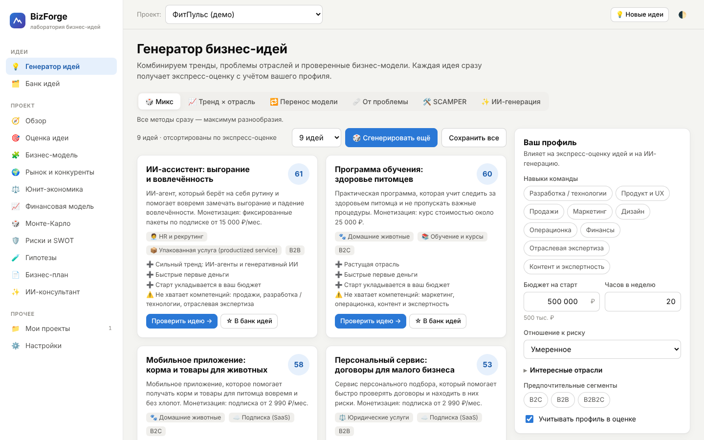
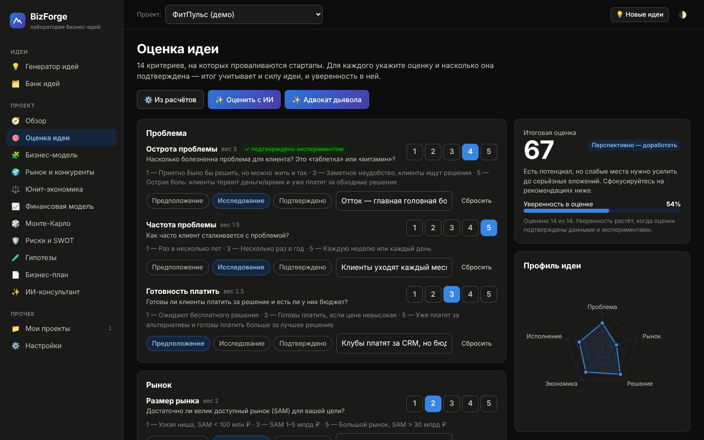
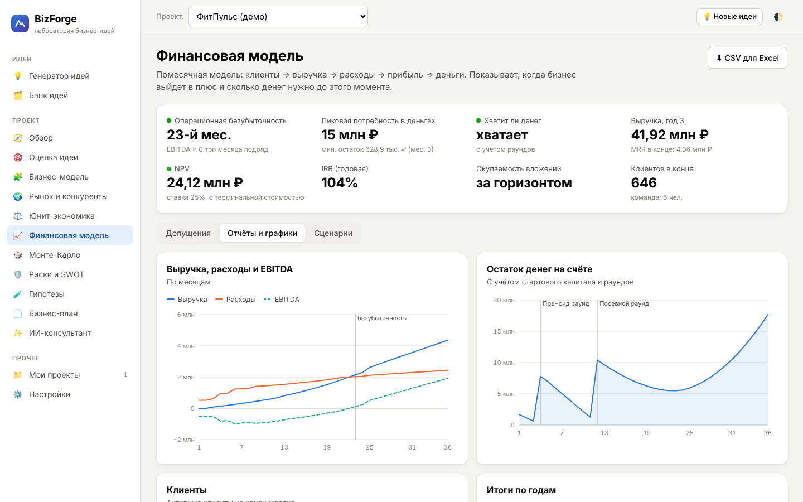
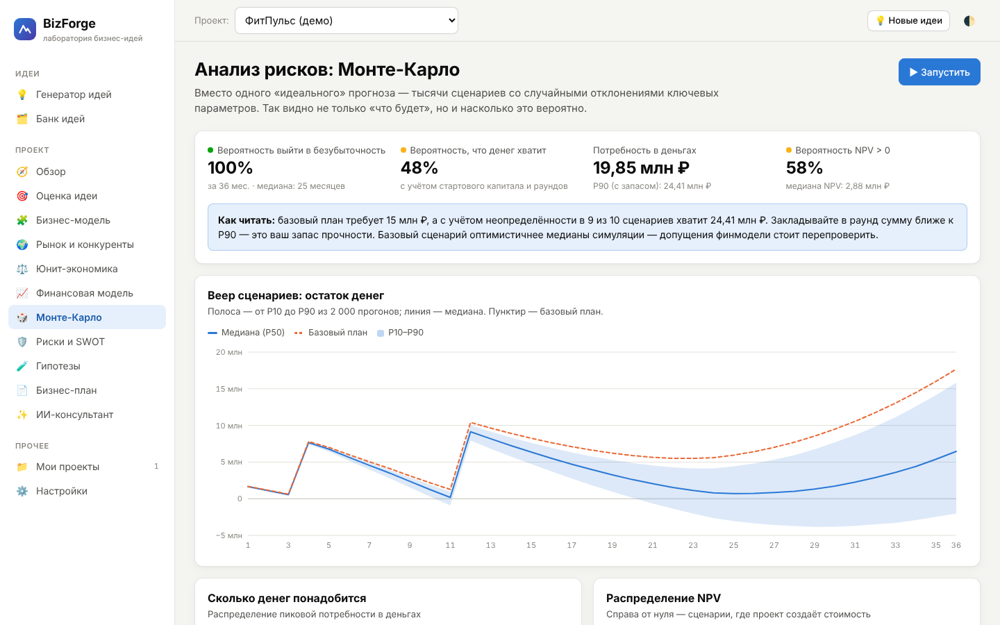

# BizForge — лаборатория бизнес-идей

**BizForge** помогает пройти путь от «хочу свой бизнес» до готового бизнес-плана с цифрами:
генерирует идеи, жёстко проверяет их по 14 критериям, строит бизнес-модель, считает рынок,
юнит-экономику и помесячную финансовую модель, оценивает риски методом Монте-Карло и собирает
бизнес-план для инвестора. Опционально подключается ИИ на базе Claude.



## Возможности

| Раздел                    | Что делает                                                                                                                                                                                                                                                                                                                                                                     |
| ------------------------- | ------------------------------------------------------------------------------------------------------------------------------------------------------------------------------------------------------------------------------------------------------------------------------------------------------------------------------------------------------------------------------ |
| 💡 **Генератор идей**     | 5 методов: «Тренд × отрасль», «Перенос модели» («Uber для…»), «От проблемы», SCAMPER и ИИ-генерация. База знаний: 24 отрасли, 78 реальных проблем клиентов, 16 трендов, 15 бизнес-моделей, 14 компаний-аналогов. Каждая идея сразу получает экспресс-оценку с учётом **вашего профиля**: навыков, бюджета, интересов.                                                          |
| 🗂️ **Банк идей**          | Избранное, поиск, своя идея, пересчёт оценок под профиль и **сравнение идей** бок о бок по 6 факторам.                                                                                                                                                                                                                                                                         |
| 🎯 **Оценка идеи**        | 14 взвешенных критериев (острота проблемы, готовность платить, рынок, конкуренция, юнит-экономика, команда…). Для каждого указывается **уровень доказательности** (предположение / исследование / данные), поэтому итог учитывает и силу идеи, и уверенность в ней. Вердикт GO / доработать / пивот / стоп, красные флаги, радар по 5 измерениям, самые рискованные допущения. |
| 🧩 **Бизнес-модель**      | Lean Canvas и Business Model Canvas с проверкой качества заполнения, перенос Lean → BMC и библиотека из 15 моделей монетизации с типовыми метриками.                                                                                                                                                                                                                           |
| 🌍 **Рынок и конкуренты** | TAM/SAM/SOM двумя независимыми методами (сверху вниз и снизу вверх) с проверкой их согласованности, таблица конкурентов и карта позиционирования.                                                                                                                                                                                                                              |
| ⚖️ **Юнит-экономика**     | ARPU, LTV (в т. ч. дисконтированный), CAC напрямую или через воронку, LTV/CAC, окупаемость клиента, точка безубыточности, кривая прибыли клиента и **анализ чувствительности** (торнадо-диаграмма).                                                                                                                                                                            |
| 📈 **Финансовая модель**  | Помесячная модель на 2–5 лет: клиенты (платный маркетинг, органика, рекомендации, отток), выручка, команда со страховыми взносами, расходы, капвложения с амортизацией, раунды, налоги (УСН 6% / 15%, налог на прибыль с переносом убытков). Безубыточность, пиковая потребность в деньгах, дефицит, NPV, IRR, окупаемость. Три сценария и экспорт в CSV.                      |
| 🎲 **Монте-Карло**        | Тысячи сценариев с треугольными распределениями ключевых допущений: веер P10–P90 остатка денег, вероятность безубыточности, вероятность что денег хватит, распределения потребности в деньгах и NPV.                                                                                                                                                                           |
| 🛡️ **Риски и SWOT**       | Реестр рисков с матрицей «вероятность × влияние», библиотека из 22 типовых рисков, SWOT с автоподсказками из анализа и пре-мортем.                                                                                                                                                                                                                                             |
| 🧪 **Гипотезы**           | Приоритизация рискованных гипотез, библиотека из 12 экспериментов (интервью, smoke-тест, консьерж-MVP, предпродажа, пилот…) с пошаговыми инструкциями и скрипт проблемного интервью. Подтверждённая гипотеза автоматически повышает уверенность в оценке.                                                                                                                      |
| 📄 **Бизнес-план**        | Собирается автоматически из всех разделов (11 глав с таблицами), любой раздел можно переписать вручную или улучшить с ИИ. Экспорт в Markdown, HTML и PDF (печать).                                                                                                                                                                                                             |
| 🧭 **Обзор**              | Индекс готовности проекта и **проверка согласованности**: приложение само находит противоречия между разделами (например, выручка больше рынка, ARPU в юнит-экономике не совпадает с финмоделью, денег не хватает).                                                                                                                                                            |
| ✨ **ИИ (Claude)**        | Генерация идей под профиль, «адвокат дьявола», оценка по критериям, заполнение Lean Canvas, оценка рынка, поиск конкурентов и рисков, гипотезы, улучшение разделов плана, питч для инвесторов и чат-консультант, который видит весь проект.                                                                                                                                    |

<p>
  
  
  
  
</p>

## Быстрый старт

Нужен Node.js 20 или новее.

```bash
npm install
npm run dev          # http://localhost:5173
```

При первом запуске открывается полностью заполненный демо-проект «ФитПульс», на котором видно работу всех разделов.

Другие команды:

```bash
npm test              # 60 тестов: расчётное ядро, ИИ-клиент, отрисовка всех страниц
npm run format        # форматирование кода (Prettier)
npm run typecheck     # проверка типов TypeScript
npm run build         # продакшен-сборка в dist/
npm run build:single  # один файл dist-single/bizforge.html — открывается двойным щелчком, без сервера
```

## ИИ-функции

Всё, кроме ИИ, работает без интернета и без регистрации. Чтобы включить ИИ:

1. Получите API-ключ в [Anthropic Console](https://console.anthropic.com/settings/keys).
2. Откройте **Настройки → ИИ на базе Claude**, вставьте ключ и нажмите «Проверить подключение».

Ключ хранится только в localStorage вашего браузера, не попадает в экспорт данных и отправляется
напрямую в `api.anthropic.com`. Если BizForge открыт как артефакт на claude.ai, ключ не нужен:
ИИ работает через аккаунт Claude зрителя (с его разрешения), а экспорт файлов — через диалог сохранения claude.ai. Модель по умолчанию — Claude Opus 5.5; в настройках можно выбрать
Sonnet 5.5 или Haiku 5.5 и глубину анализа. Структурированные задачи (оценки, холсты, риски, гипотезы)
используют JSON-схемы, поэтому ответы сразу подставляются в проект. ИИ никогда не перезаписывает
оценки, которые вы подтвердили данными.

## Методология

- **Оценка идеи.** Итог = взвешенное среднее оценок 1–5, приведённое к 0–100. Уверенность — средневзвешенная
  сила доказательств (предположение 0,2 · исследование 0,6 · данные 1,0). Вердикт учитывает и балл, и
  красные флаги (например, острота проблемы ≤ 2 или готовность платить ≤ 2).
- **Юнит-экономика.** ARPU = средний чек × покупок в месяц; срок жизни = 1 / отток; LTV = ARPU × маржа × срок
  жизни; окупаемость = CAC / (ARPU × маржа). Ориентиры: LTV/CAC ≥ 3, окупаемость ≤ 12 мес.
- **Финмодель.** Активные клиенты(t) = активные(t−1) × (1 − отток) + маркетинг/CAC + органика + рекомендации.
  Отток 100% моделирует разовые продажи. Безубыточность — первый месяц, с которого EBITDA ≥ 0 три месяца подряд.
  Потребность в деньгах — максимальная накопленная просадка свободного денежного потока. NPV и IRR
  считаются помесячно, с терминальной стоимостью = EBITDA последних 12 месяцев × мультипликатор.
- **Монте-Карло.** Каждый параметр задаётся треугольным распределением (минимум / наиболее вероятное / максимум)
  как множитель к базовому значению; генератор случайных чисел детерминирован (seed), поэтому результаты воспроизводимы.
- **Рынок.** Сверху вниз: клиенты × годовые расходы × доля сегмента × достижимая доля. Снизу вверх:
  целевые клиенты × цена × частота × охват × конверсия. Расхождение оценок больше чем в 3 раза — сигнал перепроверить данные.

Подходы опираются на Lean Canvas (Эш Мауря), Business Model Canvas (Александр Остервальдер),
«Спроси маму» (Роб Фитцпатрик), метод SCAMPER и практику венчурной оценки стартапов.

## Архитектура

```
src/
  core/            чистая расчётная логика без UI, покрыта тестами
    knowledge/     база знаний: отрасли, тренды, бизнес-модели, эксперименты, риски
    generator.ts   генератор идей и экспресс-оценка
    validation.ts  14 критериев, вердикт, красные флаги
    unitEconomics.ts, market.ts, finance.ts, monteCarlo.ts
    analysis.ts    сводный анализ проекта, проверки согласованности, индекс готовности
    businessPlan.ts сборка бизнес-плана в Markdown
  ai/              клиент Claude API (стриминг, JSON-схемы, fallback) и промпты
  platform.ts      возможности просмотрщика claude.ai, когда приложение опубликовано как артефакт
  state/           хранилище с сохранением в localStorage, импорт/экспорт
  ui/              страницы, компоненты и SVG-графики без сторонних библиотек
```

Стек: React 19, TypeScript, Vite, Vitest, официальный SDK `@anthropic-ai/sdk`. Графики — собственные SVG-компоненты
с подсказками при наведении, светлой и тёмной темой.

## Данные и приватность

Проекты, идеи и диалоги хранятся только в вашем браузере. Делайте резервные копии через
**Настройки → Экспорт всех данных** (JSON); отдельный проект можно экспортировать на странице «Мои проекты».

---

Расчёты BizForge — инструмент для размышлений, а не гарантия результата. Проверяйте ключевые допущения на реальных клиентах.
